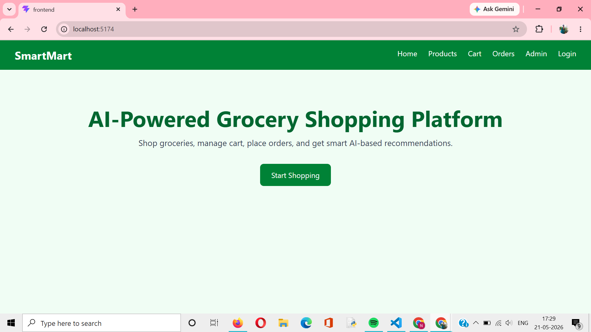
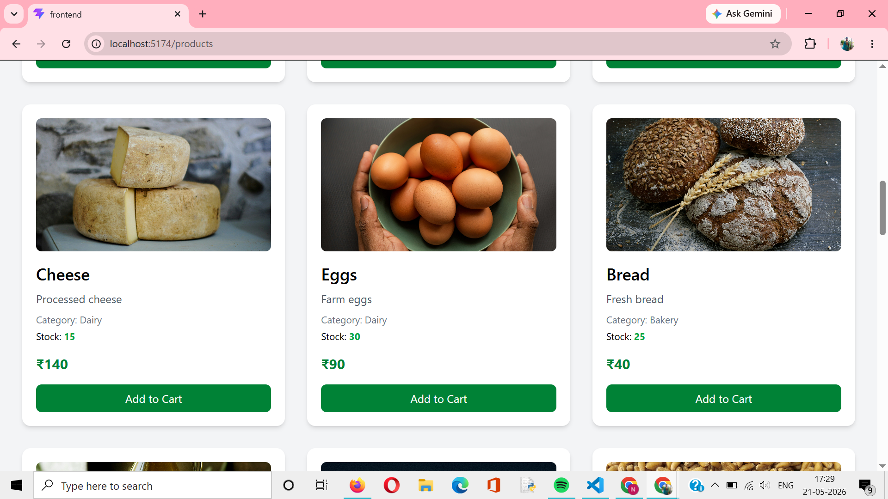
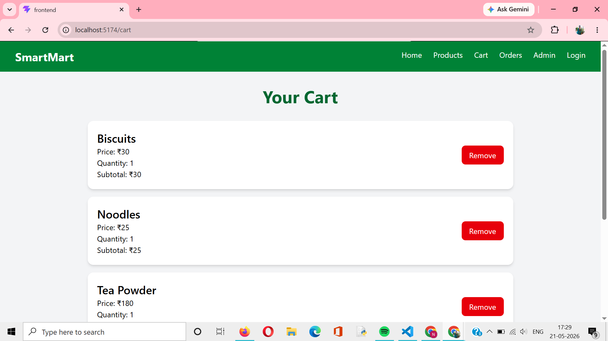
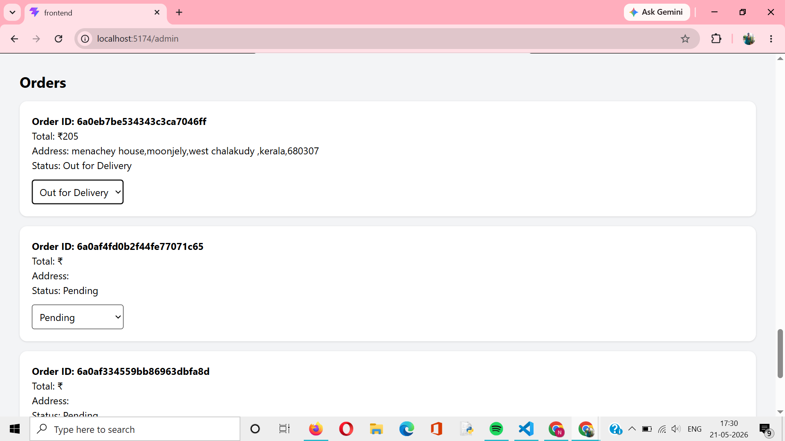
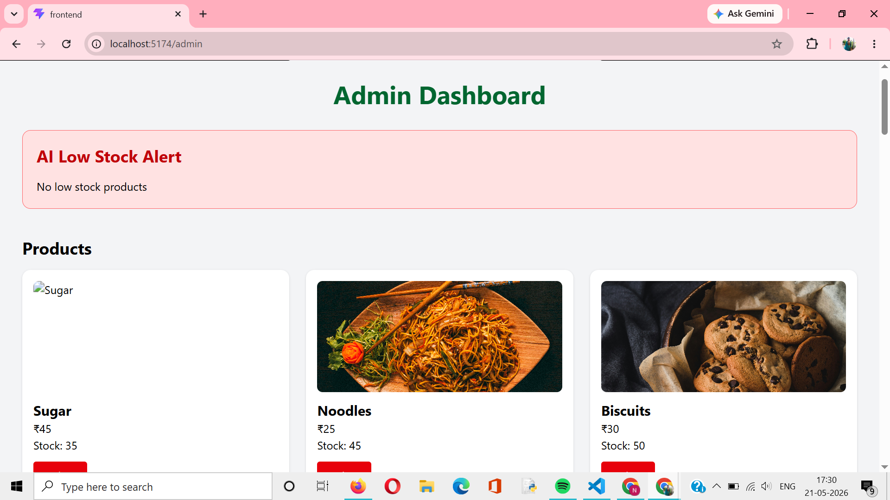
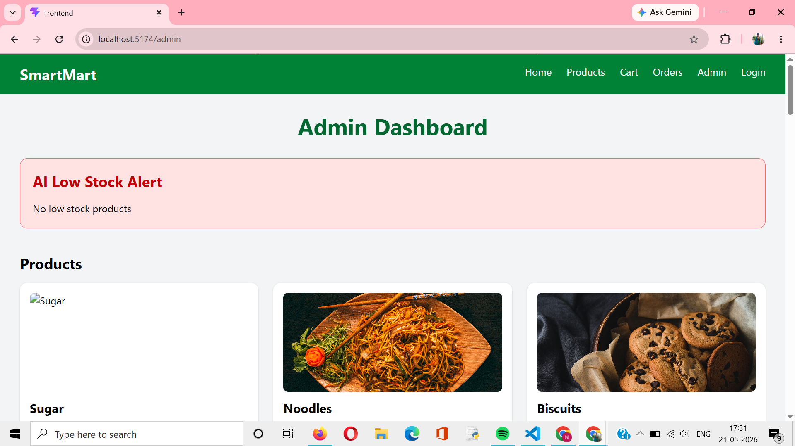

# SmartMart AI Grocery Shopping Platform

SmartMart is a full-stack AI-powered grocery shopping web application built using the MERN stack. Users can browse grocery products, add items to cart, place orders, and manage shopping efficiently. Admins can monitor products, manage orders, and track low-stock items using AI-based inventory monitoring.

---

# Features

## User Features
- Browse grocery products
- Search products instantly
- Filter products by category
- Add products to cart
- Remove items from cart
- Checkout and place orders
- View order history
- Responsive modern UI

## Admin Features
- View all products
- Delete products
- View all customer orders
- Update order status
- AI-powered low stock alerts

## AI Feature
- Low stock detection system
- Automatically identifies products with stock less than or equal to 5

---

# Tech Stack

## Frontend
- React.js
- Tailwind CSS
- Axios
- React Router DOM

## Backend
- Node.js
- Express.js

## Database
- MongoDB Atlas
- Mongoose ODM

## Development Tools
- VS Code
- Thunder Client / Postman
- Git & GitHub

---

# Technical Features

## Frontend Features
- Dynamic product rendering using React
- State management using React Hooks
- Product search functionality
- Category-based filtering
- Responsive UI using Tailwind CSS
- Client-side routing with React Router DOM
- API integration using Axios

## Backend Features
- RESTful API architecture
- Modular MVC folder structure
- Express.js server setup
- MongoDB CRUD operations
- Error handling using try-catch
- Environment variable configuration using dotenv

## Database Features
- MongoDB Atlas cloud database
- Mongoose schema models
- Product, Cart, and Order collections
- Real-time cart and order storage

## E-Commerce Features
- Add to cart functionality
- Cart quantity management
- Remove from cart
- Checkout system
- Order placement workflow
- Order status tracking

## Admin Features
- Product management dashboard
- Product deletion functionality
- Order management system
- Order status updates

## AI Features
- AI-powered low stock alert system
- Automatic inventory monitoring
- Low stock product detection

## Security & Scalability
- Organized MERN architecture
- Separate frontend and backend
- API-based communication
- Ready for JWT authentication integration

---

# Project Structure

```bash
smartmart-ai-grocery/
│
├── backend/
│   ├── controllers/
│   ├── middleware/
│   ├── models/
│   ├── routes/
│   ├── .env
│   └── server.js
│
├── frontend/
│   ├── src/
│   │   ├── pages/
│   │   ├── App.jsx
│   │   └── main.jsx
│
└── README.md
```

---

# Installation

## Backend Setup

```bash
cd backend
npm install
npm run dev
```

## Frontend Setup

```bash
cd frontend
npm install
npm run dev
```

---

# Environment Variables

Create a `.env` file inside the backend folder:

```env
PORT=5000
MONGO_URI=your_mongodb_connection_string
JWT_SECRET=smartmartsecret
```

---

# API Routes

## Product Routes

- GET `/api/products`
- POST `/api/products`
- PUT `/api/products/:id`
- DELETE `/api/products/:id`

## Cart Routes

- POST `/api/cart`
- GET `/api/cart/:userId`
- DELETE `/api/cart/:id`

## Order Routes

- POST `/api/orders`
- GET `/api/orders`
- GET `/api/orders/user/:userId`
- PUT `/api/orders/:id`

## AI Routes

- GET `/api/ai/low-stock`

---

# Screenshots

## Home Page


## Products Page


## Cart Page


## Orders Page


## Admin Dashboard


## AI Low Stock Alert

---

# Future Enhancements

- Payment Gateway Integration
- JWT Authentication
- AI Product Recommendation
- Email Notifications
- Real-time Delivery Tracking
- Online Payment System

---

# Author

M. K. Nandhini

---

# License

This project is developed for educational and academic purposes.